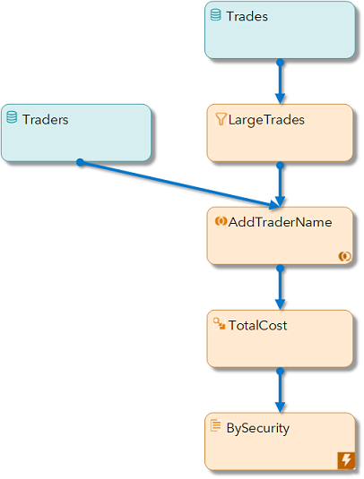
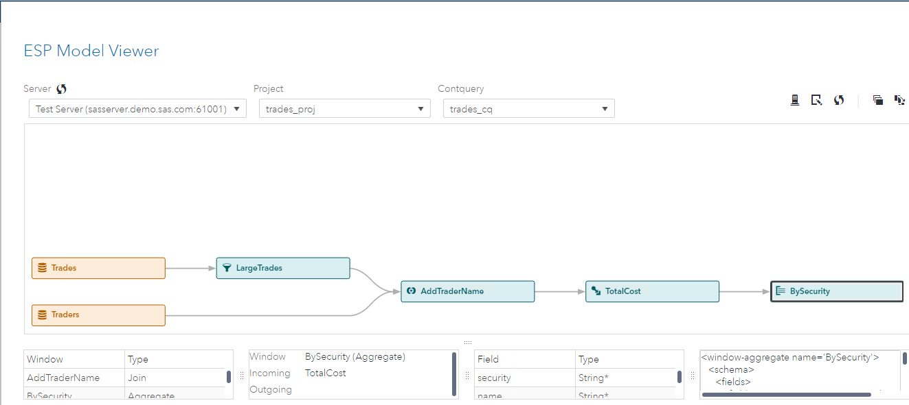
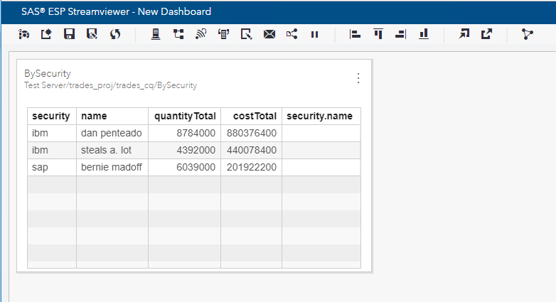

# Processing Streaming Trade Data

    

In this repository, you'll learn how to process streaming trade data using SAS Event Stream Processing (ESP) 6.2.

**Editing with ESP Studio**
[](https://players.brightcove.net/3665946608001/default_default/index.html?videoId=6136643269001 "Viewing and Editing the Model Using SAS ESP Studio") 

**Editing with a Text Editor**
[](https://players.brightcove.net/3665946608001/default_default/index.html?videoId=6136650141001 "Viewing and Editing the Model Using a Text Editor")

**Executing, Publishing, and Subscribing**
[](https://players.brightcove.net/3665946608001/default_default/index.html?videoId=6136645820001 "Executing the Model and Subscribing to the Output")

## Overview

The Processing Streaming Trade Data model is an XML model included in the examples that are installed with SAS Event Stream Processing (ESP) 6.2. It includes five ESP window types that perform various tasks on the stream.

### Model Diagram

The following is a model diagram of the Processing Streaming Trade Data model:



#### 1. Data Source Windows

There are two data source windows. The Trades window inputs the transactional records for each trade. The Traders window inputs the names of the traders which is joined with the stream. Neither window includes an input data connector. Therefore, a file/socket adapter command must be used to connect the files to the windows.

#### 2. Filter Window

Filter windows use expressions, user-defined functions, and registered plug-in functions to set up a filter condition. The LargeTrades window uses the simple expression, quantity >= 100, to filter out small trades.

#### 3. Join Window

Streaming joins take event streams from two windows and combine them into a single stream based on a key field in each stream. This model performs a one-to-many join because one trader name affects many trade events. Therefore, this is a left-outer join.

#### 4. Compute Window

Compute windows take the input stream and create an output stream using computational manipulation. New output field values are created using expressions, user-defined functions, or plug-in functions. Fields from the input stream can be passed to the output stream without manipulation, as well. This model passes through all input fields and creates field TotalCost by using the simple expression price*quantity.

#### 5. Aggregate Window

Aggregate windows place input events into groups based on one or more key fields. Output values of non-key fields are aggregated using available functions. In our model we use the sum function to output total quantity and cost by security code.


This repository includes the files required to execute the example. You can edit the model if you like. Also included are video demonstrations that include the following topics:

* Viewing and editing the model using a text editor
* Viewing and editing the model in SAS ESP Studio 
* Executing the model using the SAS ESP XML Server and subscribing to the output using SAS ESP Streamviewer.

### Prerequisites

SAS Event Stream Processing 6.2

## Getting Started

All required files are included in the SAS ESP Examples directory ($DFESP_HOME/examples). Create a server copy of the trades.xml, trades.csv, and traders.csv files, and a local copy of trades.xml for editing.

1.	Copy the files from the SAS ESP Examples directory for this example ($DFESP_HOME/examples/xml/trades_xml) to a directory to which you have write access. Example:
	
```bash
cp $DFESP_HOME/examples/xml/trades_xml/*.* /home/sasdemo/trades
```

2.	Download the trades.xml file to your local computer so it can be easily edited.

### Running

The following are instructions for executing the Processing Streaming Trade Data model. The model is ready for execution as is. For instructions on using SAS ESP Studio or a text editor to edit the model refer to the [Trades_Instrcutions](https://gitlab.sas.com/IOT/accelerators/processing-streaming-trade-data/blob/master/Trades_Instrcutions.docx) document. 

The following high-level tasks are performed to execute the model:

* Start the Model on the XML Server
* Publish the trades.csv and traders.csv files using a File/Socket Adapter
* Subscribe to the Output with SAS ESP Streamviewer

#### Start the Model on the XML Server

Use the following command line syntax to start the trades.xml model on the XML server:

```bash
$DFESP_HOME/bin/dfesp_xml_server -model file:///*yourpath*/trades.xml -http 61001 -pubsub 61002
```

where
* `$DFESP_HOME/bin/dfesp_xml_server` is the command to start the XML server
* `-model file:///*yourpath*/trades.xml` specifies the full path to the model
* `-http 61001` specifies the http port
* `-pubsub 61002` specifies the pubsub port


#### Publish the traders.csv File Using a File/Socket Adapter

Use the following syntax to publish to the traders.csv file to the Traders window using a file/socket adapter:

```bash
$DFESP_HOME/bin/dfesp_fs_adapter -C type=pub,url=”dfESP://localhost:61002/trades_proj/trades_cq/Traders”,fstype=csv,fsname=/*yourpath*/traders.csv,blocksize=256
```

where
* `$DFESP_HOME/bin/dfesp_fs_adapter -C` is the command to start a file/socket adapter
* `type=pub` indicates we are subscribing to a window
* `url=”dfESP://localhost:61002/trades_proj/trades_cq/Traders”` specifies the URL of the Traders window which includes the pubsub port, project name, continous query name, and name of the window
* `fstype=csv` specifies the file type as csv
* `fsname=/*yourpath*/traders.csv` specifies the full path to the file
* `blocksize=256` specifies the block size

#### Publish the trades.csv File Using a File/Socket Adapter

Use the following syntax to publish to the trades.csv file to the Trades window using a file/socket adapter:

```bash
$DFESP_HOME/bin/dfesp_fs_adapter -C type=pub,url=”dfESP://localhost:61002/trades_proj/trades_cq/Trades”,fstype=csv,fsname=/*yourpath*/trades.csv,blocksize=256,dateformat=%d/%b/%Y:%H:%M:%S,rate=1000
```

where
* `$DFESP_HOME/bin/dfesp_fs_adapter -C` is the command to start a file/socket adapter
* `type=pub` indicates we are subscribing to a window
* `url=”dfESP://localhost:61002/trades_proj/trades_cq/Trades”` specifies the URL of the Trades window which includes the pubsub port, project name, continous query name, and name of the window
* `fstype=csv` specifies the file type as csv
* `fsname=/*yourpath*/trades.csv` specifies the full path to the file
* `blocksize=256` specifies the block size
* `dateformat==%d/%b/%Y:%H:%M:%S` Specifies the date format used
* `rate=1000` slows the publish rate to 1000 events per second

#### Subscribe to the Output with SAS ESP Streamviewer

Use the following high-level steps to subscribe to the BySecurity window using SAS ESP Streamviewer. For more detailed steps, refer to the [Trades_Instrcutions](https://gitlab.sas.com/IOT/accelerators/processing-streaming-trade-data/blob/master/Trades_Instrcutions.docx) document.

1. Ensure the model is running and the files are being published.

2. Start **SAS ESP Streamviewer** using the following URL:

```
https://Streamviewer-host-name/SASEventStreamProcessingStreamviewer
```

3.  Click the **Show Model** button to access the **ESP Model Viewer**.
  


4.  Click the **BySecurity** window to select it and the click **Add Updating Subscriber**.

5.  Click **Close** to close the **ESP Model Viewer**. A table of values from the BySecurity window is displayed.



## Contributing

> We welcome your contributions! Please read [CONTRIBUTING.md](CONTRIBUTING.md) for details on how to submit contributions to this project. 

## License

> This project is licensed under the [Apache 2.0 License](LICENSE).

## Additional Resources

* [SAS Event Stream Processing 6.2 Product Documentation](https://go.documentation.sas.com/?cdcId=espcdc&cdcVersion=6.2&docsetId=espov&docsetTarget=home.htm&locale=en)
